# clus-devwks-2019
Cisco Live DEVWKS-2019


UC Administration is primarily driven through GUIs. 

This session will help you become confident in using the AXL API. 


Why are API's so hard with CUCM?


You aren't alone, it's easy to get bogged down when getting started.

Tools like Postman or the Pypi python library can help simplify the lift
required to use AXL.


Let's get started.
___
# Scenario 0 Prepare your environment

*We've already created this for you if everything works right. Please verify that the correct user and access role are
applied in your environment. You'll need to create a user
with AXL API access if you are doing this in your own lab. *

## Verify that the **axlapiuser** is created as an Application User.

 -   If the user is there, verify that they are assigned to the **AXL
     UCM** group with the **Standard AXL API Access** role. Now move
     to Scenario 1. (Additional roles may be added to this user for other tasks.)
-   If not, continue creating the AXL Service Account

## Create an AXL Service Account

Step 1 - Create an AXL User Group

> CUCM \> User Management \> User Group \> Add.

Step 2 - Assign the AXL role to the group

> On the top right drop down list \"Related Links\".
>
> Select \"Assign Role to User Group\" and select \"Standard AXL API
> Access\"

Step 3 - Create a new Application User (*axlapiuser/dCloud123!*)

> CUCM \> User Management \> Application User \> Add.
>
> Step 4 - Add the User Group \"AXL Group\" to this user so that after
> saving the roles of the new Application User appear as in the
> following screen:
>
> 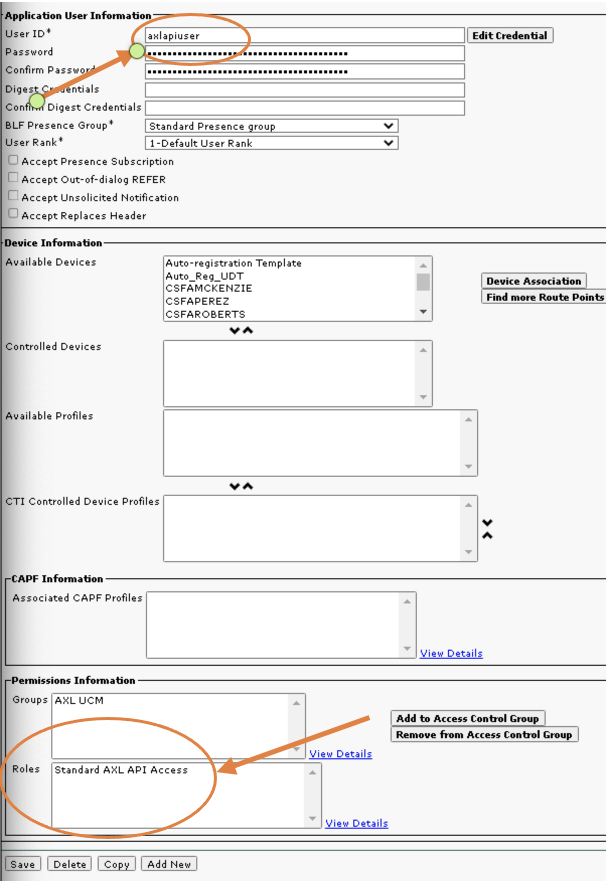
___
# Scenario 1 UCM AXL Use Cases using Postman

We'll Start by connecting Postman to our UCM server to ensure that your
user is working and AXL is up and running.

**Test Your Connection:**

-   Open Postman on Workstation 1

-   Create your first request by entering the URL in the address bar

    -   <https://cucm1.dcloud.cisco.com:8443/axl/>

-   Configure Authorization with Basic Auth and the Username/Password
    variables you created above.

-   Then hit Send to send your request to verify everything is working.

    -   If prompted, disable SSL verification.

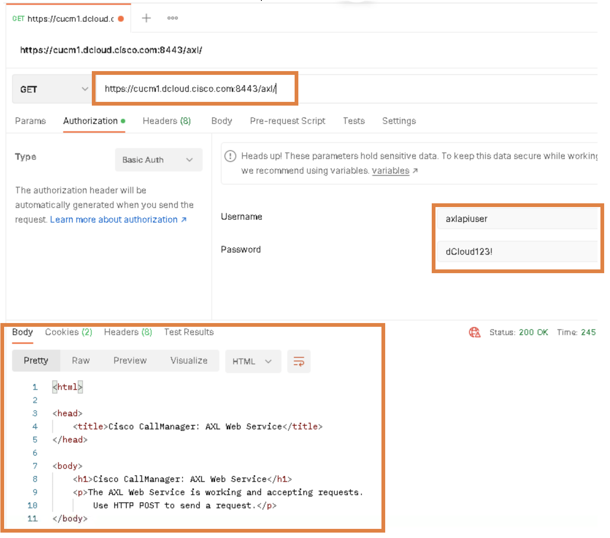

**Congratulations! You have sent your first request to the AXL API!**

Now let's get our feet wet by doing some easy queries.

We are going to find a user and then see if they need a hard phone.

**Get User info from UCM**

-   Change your request from GET to POST.

-   Add your first query (SOAP Envelope) to the Body
```xml
<soapenv:Envelope xmlns:soapenv="http://schemas.xmlsoap.org/soap/envelope/" xmlns:ns="http://www.cisco.com/AXL/API/12.5">
    <soapenv:Header/>
        <soapenv:Body>
            <ns:getUser>
                <userid>jli</userid>
            </ns:getUser>
        </soapenv:Body>
</soapenv:Envelope>
```
-   Then hit Send to see who the user is.

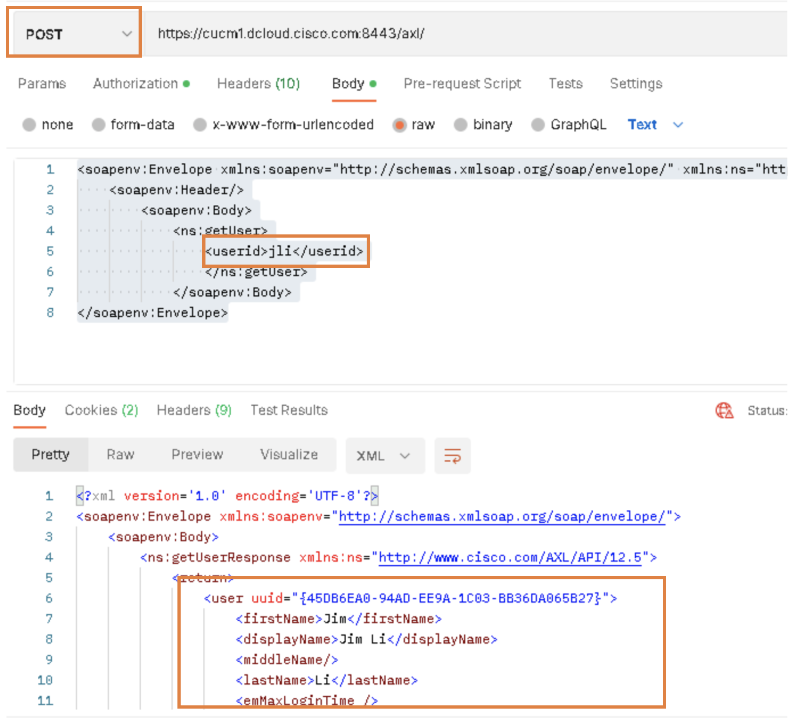

-   **You should receive the following response.**
```xml
<?xml version='1.0' encoding='UTF-8'?>
<soapenv:Envelope xmlns:soapenv="http://schemas.xmlsoap.org/soap/envelope/">
    <soapenv:Body>
        <ns:getUserResponse xmlns:ns="http://www.cisco.com/AXL/API/12.5">
            <return>
                <user uuid="{45DB6EA0-94AD-EE9A-1C03-BB36DA065B27}">
                    <firstName>Jim</firstName>
                    <displayName>Jim Li</displayName>
                    <middleName/>
                    <lastName>Li</lastName>
                    <emMaxLoginTime />
                    <userid>jli</userid>
                    <password/>
                    <pin/>
                    <mailid>jli@dcloud.cisco.com</mailid>
                    <department>Sales</department>
                    <manager>tbard</manager>
                    <userLocale />
                    <associatedDevices>
                        <device>CSFJLI</device>
                    </associatedDevices>
                    <primaryExtension>
                        <pattern>\+14085554019</pattern>
                        <routePartitionName>DN</routePartitionName>
                    </primaryExtension>
                    <associatedPc/>
                    <associatedGroups>
                        <userGroup>
                            <name>Standard CCM End Users</name>
                            <userRoles>
                                <userRole>Standard CCM End Users</userRole>
                                <userRole>Standard CCMUSER Administration</userRole>
                            </userRoles>
                        </userGroup>
                        <userGroup>
                            <name>Standard CTI Enabled</name>
                            <userRoles>
                                <userRole>Standard CTI Enabled</userRole>
                            </userRoles>
                        </userGroup>
                    </associatedGroups>
                    <enableCti>true</enableCti>
                    <digestCredentials/>
                    <phoneProfiles/>
                    <defaultProfile/>
                    <presenceGroupName uuid="{AD243D17-98B4-4118-8FEB-5FF2E1B781AC}">Standard Presence group</presenceGroupName>
                    <subscribeCallingSearchSpaceName/>
                    <enableMobility>false</enableMobility>
                    <enableMobileVoiceAccess>false</enableMobileVoiceAccess>
                    <maxDeskPickupWaitTime>10000</maxDeskPickupWaitTime>
                    <remoteDestinationLimit>4</remoteDestinationLimit>
                    <associatedRemoteDestinationProfiles/>
                    <passwordCredentials>
                        <pwdCredPolicyName>Default Credential Policy</pwdCredPolicyName>
                        <pwdCredUserCantChange>false</pwdCredUserCantChange>
                        <pwdCredUserMustChange>false</pwdCredUserMustChange>
                        <pwdCredDoesNotExpire>true</pwdCredDoesNotExpire>
                        <pwdCredTimeChanged>February 28, 2020 16:05:58 PST</pwdCredTimeChanged>
                        <pwdCredTimeAdminLockout/>
                        <pwdCredLockedByAdministrator>false</pwdCredLockedByAdministrator>
                    </passwordCredentials>
                    <pinCredentials>
                        <pinCredPolicyName>Default Credential Policy</pinCredPolicyName>
                        <pinCredUserCantChange>true</pinCredUserCantChange>
                        <pinCredUserMustChange>false</pinCredUserMustChange>
                        <pinCredDoesNotExpire>true</pinCredDoesNotExpire>
                        <pinCredTimeChanged>February 28, 2020 16:05:58 PST</pinCredTimeChanged>
                        <pinCredTimeAdminLockout/>
                        <pinCredLockedByAdministrator>false</pinCredLockedByAdministrator>
                    </pinCredentials>
                    <associatedTodAccess/>
                    <status>1</status>
                    <enableEmcc>false</enableEmcc>
                    <associatedCapfProfiles/>
                    <ctiControlledDeviceProfiles/>
                    <patternPrecedence />
                    <numericUserId />
                    <mlppPassword />
                    <customUserFields/>
                    <homeCluster>true</homeCluster>
                    <imAndPresenceEnable>true</imAndPresenceEnable>
                    <serviceProfile uuid="{5F671E84-E2BA-541C-3B06-6D661644432E}">UC Service Profile</serviceProfile>
                    <lineAppearanceAssociationForPresences>
                        <lineAppearanceAssociationForPresence uuid="{3F57EC12-A061-5010-D28C-DB7F3BD55A56}">
                            <laapAssociate>t</laapAssociate>
                            <laapProductType>Cisco Unified Client Services Framework</laapProductType>
                            <laapDeviceName>CSFJLI</laapDeviceName>
                            <laapDirectory>\+14085554019</laapDirectory>
                            <laapPartition>DN</laapPartition>
                            <laapDescription>Jim Li jli +14085554019</laapDescription>
                        </lineAppearanceAssociationForPresence>
                    </lineAppearanceAssociationForPresences>
                    <directoryUri>jli@dcloud.cisco.com</directoryUri>
                    <telephoneNumber>+14085554019</telephoneNumber>
                    <title>Sales Engineer</title>
                    <mobileNumber/>
                    <homeNumber/>
                    <pagerNumber/>
                    <extensionsInfo>
                        <extension uuid="{F134A455-3B3B-4A88-B0A4-8EFCD28C5EB5}">
                            <sortOrder />
                            <pattern uuid="{EB8F7731-8372-F8A5-9F6A-948602B650FC}">\+14085554019</pattern>
                            <routePartition>DN</routePartition>
                        </extension>
                    </extensionsInfo>
                    <selfService>19725554019</selfService>
                    <userProfile/>
                    <calendarPresence>false</calendarPresence>
                    <ldapDirectoryName uuid="{2D2FC3FF-96BF-9DAF-CE33-ECE87D7E30FA}">Local</ldapDirectoryName>
                    <userIdentity>jli@dcloud.cisco.com</userIdentity>
                    <nameDialing/>
                    <ipccExtension/>
                    <ipccRoutePartition/>
                    <convertUserAccount uuid="{2D2FC3FF-96BF-9DAF-CE33-ECE87D7E30FA}">Local</convertUserAccount>
                    <enableUserToHostConferenceNow>false</enableUserToHostConferenceNow>
                    <attendeesAccessCode/>
                    <customerName/>
                </user>
            </return>
        </ns:getUserResponse>
    </soapenv:Body>
</soapenv:Envelope>
```
-   **You've found a lot of information. Now let's filter it down to
    just the associated devices and see if he's got a phone**

    -   **Duplicate the tab and replace the body with the
        \<returnedTags\> element and the \<associatedDevices\> section
        added. The % is used as a wild card.**
```xml
<soapenv:Envelope xmlns:soapenv="http://schemas.xmlsoap.org/soap/envelope/" xmlns:ns="http://www.cisco.com/AXL/API/12.5">
                <soapenv:Header/>
                <soapenv:Body>
                    <ns:getUser>
                        <userid>jli</userid>
                        <returnedTags>
                            <associatedDevices>
                                <device>%</device>
                            </associatedDevices>
                        </returnedTags>
                    </ns:getUser>
                </soapenv:Body>
   </soapenv:Envelope>
```
-   **Hit Send and it should look like this:**

> 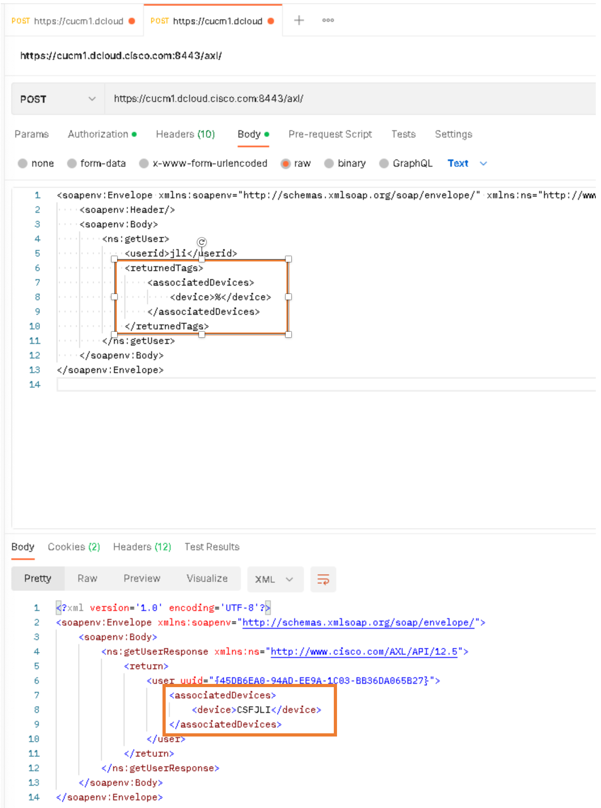

-   **You should receive the following XML response:**
```xml
<?xml version='1.0' encoding='UTF-8'?>
<soapenv:Envelope xmlns:soapenv="http://schemas.xmlsoap.org/soap/envelope/">
    <soapenv:Body>
        <ns:getUserResponse xmlns:ns="http://www.cisco.com/AXL/API/12.5">
            <return>
                <user uuid="{45DB6EA0-94AD-EE9A-1C03-BB36DA065B27}">
                    <associatedDevices>
                        <device>CSFJLI</device>
                    </associatedDevices>
                </user>
            </return>
        </ns:getUserResponse>
    </soapenv:Body>
</soapenv:Envelope>
```
___
# Section 1.A Postman Collections

Postman community members have created collections to help you
streamline your experience and not have to read through API documents to
figure out specific formatting. We are going to next import the Postman
Collection for UCM's AXL API, create Environment variables, and then
we'll add a phone.

**Download the collection and setup environment variables:**

-   Open a browser and navigate to https://cs.co/devwks-2019. Download the Cisco
    CUCM.postman_collection.json file and save it to the C:\\DEVWKS-2019
    folder. If you don't have a github account, the file is also
    available for you under the \\answers folder.

-   Now we need to import the collection. In the top left of your
    Postman window, click on the Collections Icon

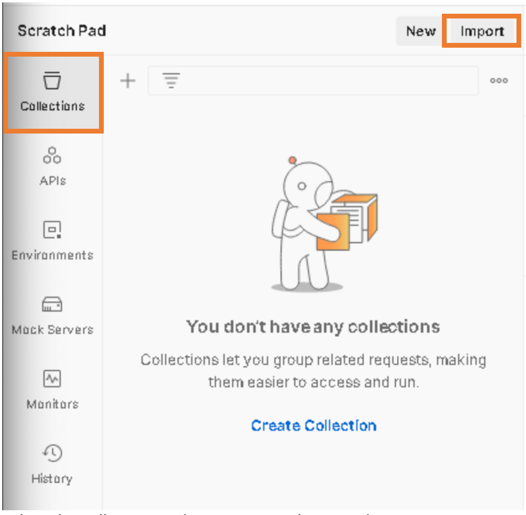

-   Select the collection and import using the wizard.

-   Expand the sections and select the Test Connectivity and get a
    cookie. Notice the use of variables. We'll need to create variables
    to use this collection or hard code the answers.

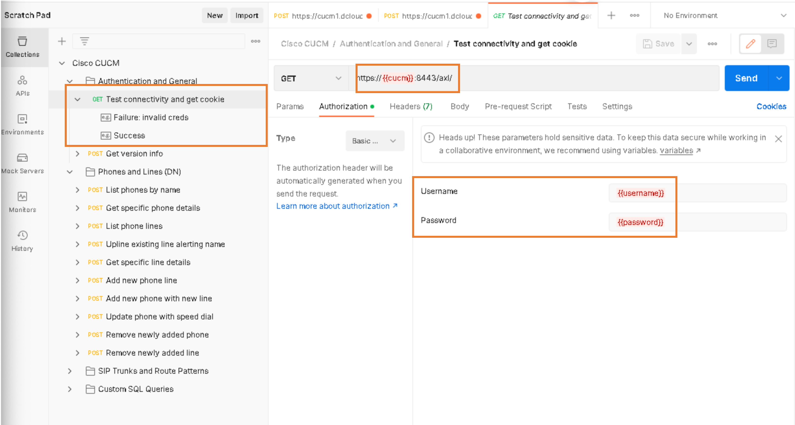

-   We add environment variables by clicking on the top right icon to
    expand the environment variables window and then add a variable


-   Name your collection and then add the following variables:
```python
    -   cucm = cucm1.dcloud.cisco.com

    -   username = axlapiuser

    -   password = dCloud123!

    -   schema_ver = 12.5
```
-   Save your environment variables and change the environment to your
    new Environment.

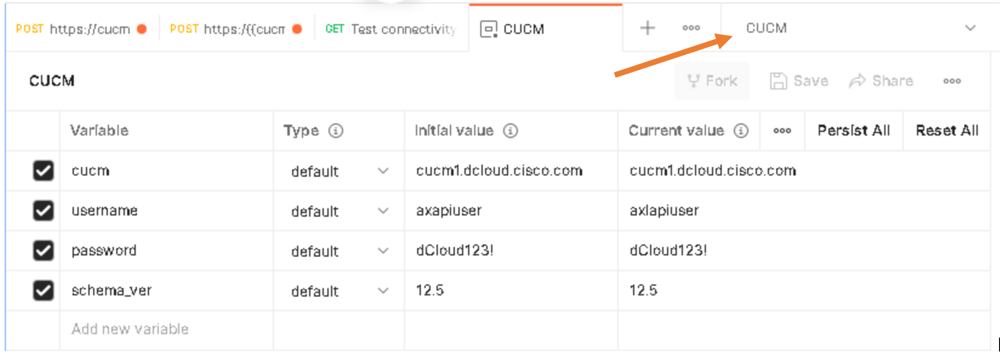

-   Now go back to the Test connectivity tab and hit Send. You should
    get back XML as follows:
```xml
<html>

<head>
	<title>Cisco CallManager: AXL Web Service</title>
</head>

<body>
	<h1>Cisco CallManager: AXL Web Service</h1>
	<p>The AXL Web Service is working and accepting requests.
		Use HTTP POST to send a request.</p>
</body>

</html>
```
-   If you receive a 400 error message, go back to your environment
    variables and ensure that they are typed in correctly.

**Add a phone:**

Now you are ready to add a phone for Mr Li.

-   In the collection window, choose "Add new phone with new line".
    Select the Body window to set the variables for the new phone.

> 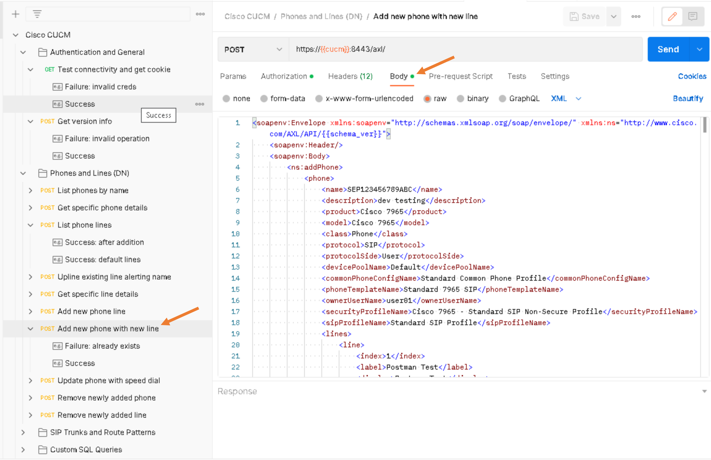

-   Replace the body content with the following and hit Send:
```xml
<soapenv:Envelope xmlns:soapenv="http://schemas.xmlsoap.org/soap/envelope/" xmlns:ns="http://www.cisco.com/AXL/API/{{schema_ver}}">
    <soapenv:Header/>
    <soapenv:Body>
        <ns:addPhone>
            <phone>
                <name>SEPA4A4A4A4A4A4</name>
                 <description>8865 for Jim Li</description>
                <product>Cisco 8865</product>
                <model>Cisco 8865</model>
                <class>Phone</class>
                <protocol>SIP</protocol>
                <protocolSide>User</protocolSide>
                <devicePoolName>Conferencing</devicePoolName>
                <commonPhoneConfigName>Standard Common Phone Profile</commonPhoneConfigName>
                <ownerUserName>jli</ownerUserName>
                <securityProfileName>Universal Device Template - Model-independent Security Profile</securityProfileName>
                <sipProfileName>Standard SIP Profile</sipProfileName>
                <lines>
                    <line>
                        <index>1</index>
                        <label>Jim Li</label>
                        <display>Jim Li</display>
                        <dirn>
                            <pattern>\+14085554019</pattern>
                           <routePartitionName>DN</routePartitionName>
                        </dirn>
                    </line>
                </lines>
            </phone>
        </ns:addPhone>
    </soapenv:Body>
</soapenv:Envelope>
```
-   You should receive the following XML response though the return ID
    will most likely be different:
```xml
<?xml version='1.0' encoding='UTF-8'?>
<soapenv:Envelope xmlns:soapenv="http://schemas.xmlsoap.org/soap/envelope/">
    <soapenv:Body>
        <ns:addPhoneResponse xmlns:ns="http://www.cisco.com/AXL/API/12.5">
            <return>{589567D4-3477-1EA5-AD1E-C9C717BF6626}</return>
        </ns:addPhoneResponse>
    </soapenv:Body>
</soapenv:Envelope>
```

*BONUS: With the tools you have at your fingertips, can you verify that
the phone was created?*
>Hint - We didn't associate the device to the user in the request, so you might have to use a different query.

**Congratulations! Now you can go forward and be dangerous! (Or just
progress to the next scenario).**

___
# Scenario 2 Python and AXL

This scenario will help you explore the pypi python library and other
libraries that will help simplify the process. Pypi AXL is one of many
public projects with reference information can be found here:
<https://pypi.org/project/ciscoaxl/>. Then we'll get deeper into the API
with Python where the pypi library is limited.

**Setup your environment:**

-   First know that the latest python version was installed on your
    workstation. We didn't install a traditional IDE on the workstation,
    so we are going to ask you to use either a command line and Notepad
    ++ (if you need formatting help) or the Powershell ISE. All the
    screenshots will be using the Powershell ISE interface.

-   Open the Powershell ISE interface. In the terminal window, navigate
    to the c:/DEVWKS-2019/ directory.

-   Open file in this directory called hello.py

    -   Verify that this is in the file: `print(\'hello world\')`

    -   Save the file

-   In the terminalwindow type `py .\\hello.py` and press enter.

-   If everything was installed correctly, you should see "hello world"
    back from your python script:


-   Now let's install the Pypi AXL SDK library. In the terminal window
    type `pip install ciscoaxl` and press enter.

    -   If the libraries have already been installed, you'll be notified
        that the requirements were already satisfied.

    -   Feel free to ignore warnings about updating packages.

-   Now your environment is setup and ready to go.

**Connect and get some phone data:**

In the previous environment, we added a phone to Jim Li. We will first
see if that phone was created and then dig in to see how easy it is to
utilize the SDK.

-   The foundation portion of this script will be to import the ciscoaxl
    library and to connect to the UCM environment. In your Powershell
    ISE, open the file (ucm.py) and verify this section:
```python
from ciscoaxl import axl
 
cucm = 'cucm1.dcloud.cisco.com'
username = 'axlapiuser'
password = 'dCloud123!'
version = '12.5'
ucm = axl(username=username,password=password,cucm=cucm,cucm_version=version)
```
> \*\*\*\*This should look familiar as it's the same info we created in
> our environment variables in Postman. This isn't the recommended way
> to store authorization credentials, but we are learning so we can do
> it here.\*\*\*\*\*\*

-   Now let's query to see if we can find the phone we created in
    Postman. Add the following to your script:
```python
for phone in ucm.get_phones():

print(phone.name)
```
-   Save the file and run '**py .\\ucm.py'** in the terminal window.

-   You should see a list of phones including the one you created *(SEPA4A4A4A4A4A4)*


> 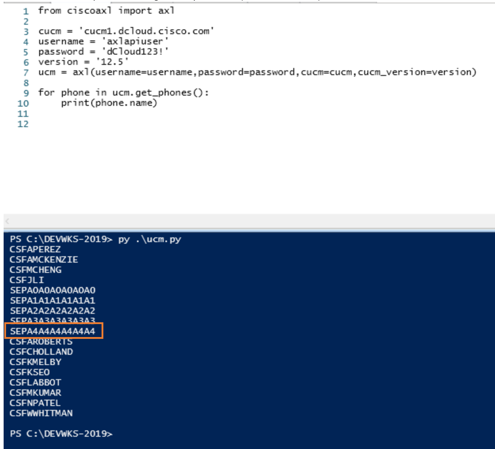

-   Let's see if we can get more information about these phones that you
    may need to utililze for reporting/tracking assets. Update your
    script body with the following commands:
```python
phoneslist = ucm.get_phones()

for phones in phoneslist:
print (phones)
```
-   This will give us all the data for all the phones. That may not be
    useful for you. Let's pair it down to get the description, name,
    location name and phone type.

-   Update your print statement to return only those items:
```python
phoneslist = ucm.get_phones()
 
for phones in phoneslist:
print (phones.description, phones.name, phones['locationName']['_value_1'], phones.product)
```
-   Your results should look like this after you save the file and run
    it:


-   You can export this data in python by changing "print" to the
    corresponding export command.

**What about phone numbers?**

-   You can also get the same reporting information to see all your
    directory numbers that are configured and assigned. The following
    will get you a list of all the DNs with the pattern, description and
    route partition assigned.

-   Update the Body with the following commands
```python
for dn in ucm.get_directory_numbers():
print(dn.pattern, dn.description, dn['routePartitionName']['_value_1'])
```


**Route Group Manipulation and the deep end of the pool**

Welcome to the deep end. Now we are going to take what we've learned and
apply it to ordering a list of devices in a route group. Your goal is to
change the order of a members of a route group. Let's start by looking
at a new route group.

-   Get the route group:
```python
rg = ucm.get_route_group(name=\'new\')
print(rg)
```
-   If this group doesn't exist, you can either add it via the GUI or
    add it via "new" with the members ST_UCM_EMEA, TRUNK_TO_CUBE-US, and
    IMP-SIP-Trunk
```python
ucm.add_route_group(
    name='new',
    distribution_algorithm='Circular',
    members=[('ST_UCM_EMEA'),('TRUNK_TO_CUBE-US'),('IMP-SIP-Trunk')]
)
```
-   You should see the following output:
```python
{
    'dialPlanWizardGenld': None,
    'distributionAlgorithm': 'Circular',
    'members': {
        'member': [
            {
                'deviceSelectionOrder': 1,
                'dialPlanWizardGenId': None,
                'deviceName': {
                    '_value_1': 'TRUNK_TO_CUBE_US',
                    'uuid': '{CC32EB93-9BB4-074C-FFF2-5839D983FCAC}'
                },
                'port': 0,
                'uuid': '{FC77DBBD-6F8C-7F94-5205-E732ECA58282}'
            },
            {
                'deviceSelectionOrder': 2,
                'dialPlanWizardGenId': None,
                'deviceName': {
                    '_value_1': 'IMP-SIP-Trunk',
                    'uuid': '{9A6C5AAA-7F99-64B2-9BF7-1EE2F7148A21}'
                },
                'port': 0,
                'uuid': '{87424137-A187-216D-2BE9-89922793210B}'
            },
            {
                'deviceSelectionOrder': 3,
                'dialPlanWizardGenId': None,
                'deviceName': {
                    '_value_1': 'ST_UCM_EMEA',
                    'uuid': '{883480C4-2128-3169-9BC7-04897161908F}'
                },
                'port': 0,
                'uuid': '{E7F903DB-0B57-A76D-6762-44C72321F8E5}'
            }
        ]
    },
    'name': 'new',
    'uuid': '{6FE6E2AB-3298-B26C-DB90-BE55B0AD5DFF}'
}

```
-   The order is TRUNK_TO_CUBE-US, IMP-SIP-Trunk, and ST_UCM_EMEA. Your
    goal is to switch the US and AMEA members. We will be utilizing a
    dictionary to reorder the list. The deviceSelectionOrder variable
    will swap locations in the list. Here's the script:
```python
rg = ucm.get_route_group(name='new')
print(rg)

groupmap = { "EU" : { "index" : None, "order": None},
             "US" : { "index" : None, "order": None}}
for x in range(len(rg['members']['member'])):
    if rg['members']['member'][x]['deviceName']['_value_1'] == 'ST_UCM_EMEA':
        groupmap['EU']['order'] = rg['members']['member'][x]['deviceSelectionOrder']
        groupmap['EU']['index'] = x
    elif rg['members']['member'][x]['deviceName']['_value_1'] == 'TRUNK_TO_CUBE_US':
        groupmap['US']['order'] = rg['members']['member'][x]['deviceSelectionOrder']
        groupmap['US']['index'] = x
rg['members']['member'][groupmap['US']['index']]['deviceSelectionOrder'] = groupmap['EU']['order']
rg['members']['member'][groupmap['EU']['index']]['deviceSelectionOrder'] = groupmap['US']['order']

ucm.update_route_group(name='new',members=rg.members)

rgnew = ucm.get_route_group(name='new')
print(rgnew)
```
-   Save the file and run it. You should be able to run it multiple
    times if you want to swap it back and forth. Here's the output:
```python
{
    'dialPlanWizardGenld': None,
    'distributionAlgorithm': 'Circular',
    'members': {
        'member': [
            {
                'deviceSelectionOrder': 1,
                'dialPlanWizardGenId': None,
                'deviceName': {
                    '_value_1': 'ST_UCM_EMEA',
                    'uuid': '{883480C4-2128-3169-9BC7-04897161908F}'
                },
                'port': 0,
                'uuid': '{BFA33B6C-B695-31CB-61D1-BBD8F64C06B2}'
            },
            {
                'deviceSelectionOrder': 2,
                'dialPlanWizardGenId': None,
                'deviceName': {
                    '_value_1': 'IMP-SIP-Trunk',
                    'uuid': '{9A6C5AAA-7F99-64B2-9BF7-1EE2F7148A21}'
                },
                'port': 0,
                'uuid': '{BB204302-03A5-EFC6-7D0C-A26E5A589B21}'
            },
            {
                'deviceSelectionOrder': 3,
                'dialPlanWizardGenId': None,
                'deviceName': {
                    '_value_1': 'TRUNK_TO_CUBE_US',
                    'uuid': '{CC32EB93-9BB4-074C-FFF2-5839D983FCAC}'
                },
                'port': 0,
                'uuid': '{BE362CDF-C9DB-DB6A-29E5-6CFD799C4458}'
            }
        ]
    },
    'name': 'new',
    'uuid': '{315C15AC-F5C5-C5F6-0169-E252086A9EE9}'
}
{
    'dialPlanWizardGenld': None,
    'distributionAlgorithm': 'Circular',
    'members': {
        'member': [
            {
                'deviceSelectionOrder': 3,
                'dialPlanWizardGenId': None,
                'deviceName': {
                    '_value_1': 'ST_UCM_EMEA',
                    'uuid': '{883480C4-2128-3169-9BC7-04897161908F}'
                },
                'port': 0,
                'uuid': '{79C81AB8-61F5-42A9-9408-2F6A12870F7C}'
            },
            {
                'deviceSelectionOrder': 2,
                'dialPlanWizardGenId': None,
                'deviceName': {
                    '_value_1': 'IMP-SIP-Trunk',
                    'uuid': '{9A6C5AAA-7F99-64B2-9BF7-1EE2F7148A21}'
                },
                'port': 0,
                'uuid': '{B3B5A3D0-AA80-1A54-D9A2-E3524CAACFCF}'
            },
            {
                'deviceSelectionOrder': 1,
                'dialPlanWizardGenId': None,
                'deviceName': {
                    '_value_1': 'TRUNK_TO_CUBE_US',
                    'uuid': '{CC32EB93-9BB4-074C-FFF2-5839D983FCAC}'
                },
                'port': 0,
                'uuid': '{DD8227AE-F924-30A2-20C4-C285C900FCF6}'
            }
        ]
    },
    'name': 'new',
    'uuid': '{315C15AC-F5C5-C5F6-0169-E252086A9EE9}'
}

```
**Congratulations! You've now switched orders of a Route Group.**

# Section 3 Zeep AXL, RIS70, and other APIs available in UCM.

Zeep is a Python SOAP client. We've loaded the and other requirements
prior to this to help you. You will want to use tools like Zeep when you
need information not included in the libraries/classes in tools like
Pypi. Heres the same request we did with Pypi getting a list of all the
DNs with the pattern, description and route partition assigned.

**Find phone number information in the Zeep end...**

-   Open the ucm-zeep.py file and notice the info included.

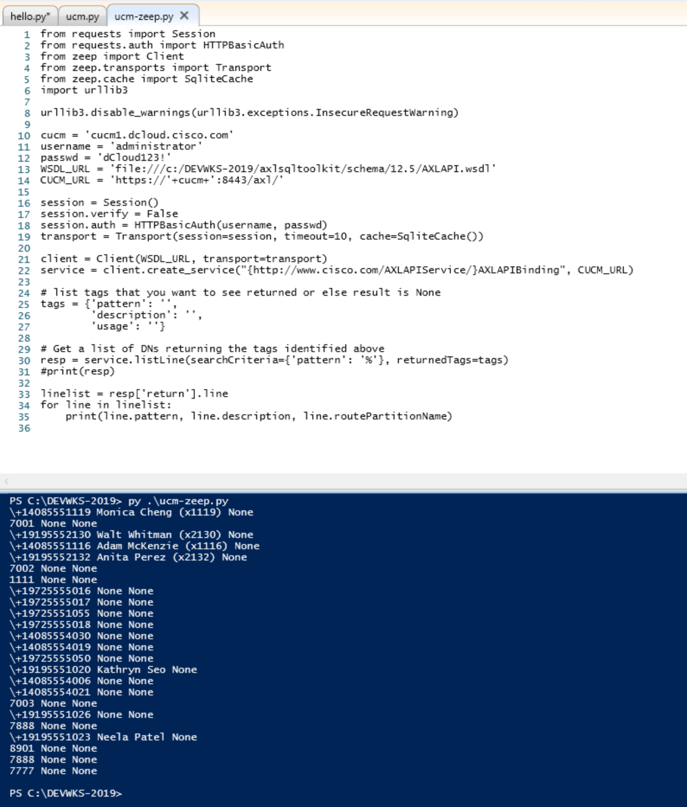

-   The request is a little different, but if you are comfortable with
    it, you can do much more with a raw client than being limited to
    specific classes.

**What else can I do with APIs on UCM?**

UCM has other APIs available to get information that are documented, but
less known.

-   **PawsToolkit**: This class enables your application to connect and
    make Platform Administrator Web Services (PAWS) API calls which is
    documented here:\
    <https://developer.cisco.com/site/paws/documents/api-reference/>

-   **UcmServiceabilityToolkit**: This class enables your application to
    connect and make Control Center Services API calls which is
    documented here:\
    <https://developer.cisco.com/docs/sxml/#!control-center-services-api-reference>

-   **UcmRisPortToolkit**: This class enables your application to
    connect and make RisPort70 API calls which is documented here:\
    <https://developer.cisco.com/docs/sxml/#!risport70-api-reference>

-   **UcmPerfMonToolkit**: This class enables your application to
    connect and make PerfMon API calls which is documented here:\
    <https://developer.cisco.com/docs/sxml/#!perfmon-api-reference>

Our bonus deliverable is to figure out a way to identify if certain
people are currently logged into Jabber. We are going to approach this
with the real-time device API. This is the RIS70.

-   Open jabber-ris.py and let's review some pieces:

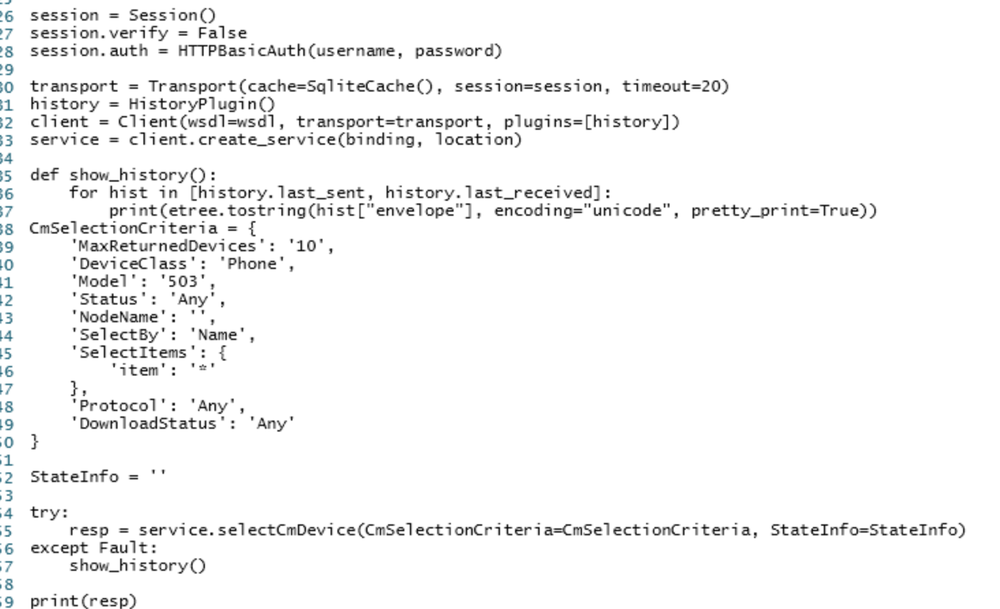

-   Model 503 = Jabber CSF.

-   Run the file. You shouldn't receive any results. Login to Jabber as
    Amckenzie on workstation 1 and aperez on wkst2. (Password is
    dCloud12345!).

-   Run the file again and see the results. We won't take time filtering
    the results but rather just show you that this is one of the many
    ways you can find this data.

And with that, you have completed the **Devwks-2019!** Now go forth and show off your new skills!


